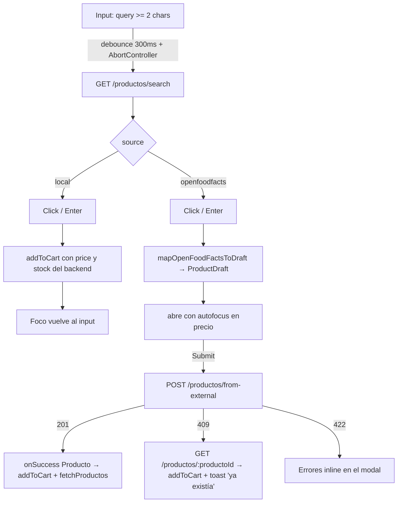

# Búsqueda de productos en la caja (POS)

> Feature de búsqueda unificada en el input principal de la caja. Combina el catálogo local del tenant con sugerencias de Open Food Facts (OFF) y permite importar un producto externo al catálogo desde la misma pantalla.
>
> Implementado: mayo 2026.

---

## 1. Resumen

En la caja, el input de búsqueda llama a `GET /productos/search?q=&limit=` y muestra dos grupos de resultados:

1. **En tu catálogo** (`source: "local"`). Click → se agrega al carrito directo.
2. **Sugerencias · Open Food Facts** (`source: "openfoodfacts"`). Click → se abre `<ProductCreationModal />` con el payload pre-cargado. Al confirmar, el backend crea el producto local (`POST /productos/from-external`) y se agrega al carrito.

El cajero nunca cobra una sugerencia sin antes ingresar precio: el modal lo exige.

## 2. Flujos al click



## 3. Diferenciación visual

- **Locales**: precio + stock en verde/ámbar/rojo según nivel. Sin badge.
- **Sugerencias OFF**: thumbnail + badge `IMPORTAR` ámbar. Sin precio (no existe). Background ámbar suave para que sea inmediatamente claro que no es un producto "listo para cobrar".
- Header de cada grupo (`En tu catálogo` / `Sugerencias · Open Food Facts`) con un microtexto que recuerda al cajero que los externos necesitan precio.

## 4. Navegación por teclado

| Tecla | Acción |
|-------|--------|
| ↑ / ↓ | Mover foco entre los resultados (locales + externos en una lista plana). |
| ↵ | Si el foco está sobre un local: agrega al carrito. Si está sobre un externo: abre el modal. |
| Esc | Cierra el dropdown y limpia el query. |

El listbox usa roles ARIA `combobox` + `listbox` + `option` + `aria-activedescendant`, lo que permite que un lector de pantalla anuncie el item en foco. Al agregar un producto o cerrar el modal el foco vuelve al input.

## 5. Performance

- **Debounce 300ms** (`useDebouncedValue`) + **cancelación con AbortController**: si el cajero sigue tipeando, el request anterior se aborta antes de llegar a re-renderizar. Evita race conditions del estilo "respondió primero el query viejo".
- **Cache LRU en memoria**: `lib/utils/productSearchCache.ts`, TTL 60s, 50 entradas. Por proceso. No hay React Query / SWR en el repo — el Map nativo cubre el caso de "borrar y volver a tipear lo mismo".
- **`React.memo`** en `<SearchDropdown />`, `<LocalRow />`, `<ExternalRow />` para que los keystrokes en el input no repinten todo el dropdown.
- **Lazy load del modal**: `lib/components/ProductCreationModal.tsx` se importa con `React.lazy` + `Suspense` desde la caja. No pesa en el bundle inicial del POS.
- **Imágenes**: `loading="lazy"` + placeholder cuando no hay `imageUrl` o falla la carga.

## 6. Cache de búsquedas

Implementación en `lib/utils/productSearchCache.ts`:

- **Key**: `${q.trim().toLowerCase()}|${limit}`.
- **TTL**: 60 s. Si el usuario importó un producto en el medio, `fetchProductos()` del store sigue siendo la fuente de verdad para la pantalla de Productos; el cache de búsqueda es independiente y de corta vida.
- **Capacidad**: 50 entradas. Al llenarse descarta la menos recientemente usada.
- **Limpieza manual**: `clearProductSearchCache()` (exportado por si se necesita después de un cambio masivo del catálogo).

El cache se inicializa por carga de página (es in-memory del cliente). Recargar limpia.

## 7. `<ProductCreationModal />` — componente reutilizable

Ubicación: `app/components/ProductCreationModal.tsx`.

**Por qué es reutilizable**: ya hay otra feature en otra rama (scanner de código de barras) que va a abrir este mismo modal cuando lea un producto no registrado. Para que el merge sea trivial, el modal **no conoce la fuente del payload**: recibe un `ProductDraft` ya normalizado.

### API

```ts
interface ProductCreationModalProps {
  isOpen: boolean;
  onClose: () => void;
  onSuccess: (createdProduct: Producto, opts: { wasExisting: boolean }) => void;
  initialData: ProductDraft;
  sourceLabel?: string;
}

interface ProductDraft {
  barcode?: string;
  name?: string;
  brand?: string;
  imageUrl?: string;
  categories?: string[];
  externalSource?: string;
}
```

- `onSuccess(producto, { wasExisting })` — `wasExisting === true` cuando el backend respondió 409 y el modal recuperó el producto existente. El consumidor decide qué hacer (agregar al carrito, mostrar toast, navegar, etc.).
- `sourceLabel` — texto informativo en el header (ej. `"Importar desde Open Food Facts"`). Puramente cosmético.
- `initialData` — todos los campos son opcionales; el modal maneja datos parciales.

### Comportamiento

- Autofocus en `price` al abrir (es lo único que el cajero siempre tiene que ingresar).
- `barcode` queda **read-only** si vino en `initialData` (es lo que identifica al producto contra el backend), editable si vino vacío.
- `name`, `brand`, `imageUrl`, `categories` son editables. Imagen tiene preview con botón "quitar" y fallback en `onError`.
- Validaciones inline: `name` no vacío, `barcode` no vacío, `price > 0`, `initialStock >= 0`.
- Al submit envía `POST /productos/from-external`:
  - **201** → `onSuccess(producto, { wasExisting: false })` + cierra.
  - **409** → lee `productoId` del cuerpo del error, hace `GET /productos/:id`, llama `onSuccess(producto, { wasExisting: true })` + cierra. El consumidor muestra el toast.
  - **422** → muestra error general + mapea `fields` a errores por campo si vienen.
- Al cancelar: cierra sin guardar (sin confirmación).

## 8. Cómo agregar una nueva fuente al modal

El modal es agnóstico de la fuente. Para sumar otra (scanner, importación CSV, lectura de un API externo, etc.) **no hace falta tocar el componente**: alcanza con escribir un mapper hacia `ProductDraft`.

Patrón:

```ts
// lib/utils/myNewSourceAdapter.ts
import type { ProductDraft } from "@/lib/types";
import type { MyNewSourcePayload } from "@/lib/types/my-new-source";

export function mapMyNewSourceToDraft(s: MyNewSourcePayload): ProductDraft {
  return {
    barcode: s.code,
    name: s.title,
    brand: s.manufacturer,
    imageUrl: s.image,
    categories: s.tags,
    externalSource: "my-new-source", // metadato semántico, lo guarda el backend
  };
}
```

Y desde donde sea que se trigueree:

```tsx
setCreateDraft(mapMyNewSourceToDraft(payload));
setCreateLabel("Importado por scanner");
setCreateOpen(true);
```

El backend recibe el mismo `POST /productos/from-external` con un `externalSource` distinto — el contrato fue diseñado genérico exactamente por esto (ver `management-back/docs/products-search.md`, sección "Por qué el contrato es genérico").

## 9. Manejo del 409 (producto ya existente)

Cuando el backend responde 409 al `POST /productos/from-external`, el cuerpo trae `productoId` con el id del producto que ya existía en el tenant para ese barcode.

El modal **no muestra un error fatal**: hace `GET /productos/:productoId`, devuelve ese Producto vía `onSuccess(producto, { wasExisting: true })` y cierra. La caja entonces:

1. Lo agrega al carrito (mismo path que cualquier otro producto creado).
2. Muestra un toast verde *"Este producto ya existía en tu catálogo — se agregó al carrito"*.
3. Refresca el store de productos (`fetchProductos`) para que la pantalla de Productos quede consistente.

Esto cubre el caso real: el cajero busca "coca", aparece la sugerencia de OFF porque el catálogo local tiene pocos resultados similares, pero ese producto en particular ya estaba cargado bajo otro nombre. La fricción es cero.

## 10. Tests

El repo todavía no tiene runner de tests configurado. Cuando se incorpore (vitest o el que se elija), cubrir como mínimo:

- Render del dropdown con resultados mezclados local + OFF.
- Click sobre local → `addToCart` directo.
- Click sobre OFF → abre modal con `initialData` mapeado.
- Submit del modal → flujo 201 (Producto creado) → `onSuccess` se invoca con `wasExisting: false`.
- Submit del modal → flujo 409 → recupera el Producto existente y `onSuccess` se invoca con `wasExisting: true`.
- `useProductSearch` cancela el request anterior al cambiar el query.
- `mapOpenFoodFactsToDraft` con categorías en formato `en:beverages` se normalizan.

## 11. Archivos involucrados

- `lib/api/productos.ts` — `searchProductos`, `createProductoFromExternal`.
- `lib/api/client.ts` — `ApiError.data` para exponer el `productoId` del 409.
- `lib/hooks/useProductSearch.ts` — debounce + AbortController + cache.
- `lib/utils/productSearchCache.ts` — Map LRU + TTL.
- `lib/utils/openFoodFactsAdapter.ts` — `mapOpenFoodFactsToDraft` (función pura).
- `lib/types/index.ts` — `ProductSearchResult`, `ProductDraft`, `CreateFromExternalPayload`, etc.
- `app/components/ProductCreationModal.tsx` — el componente reutilizable.
- `app/(app)/caja/page.tsx` — wireup en la pantalla de caja, `SearchDropdown`, manejo de toast y foco.

Contrato del backend: `management-back/docs/products-search.md`.
